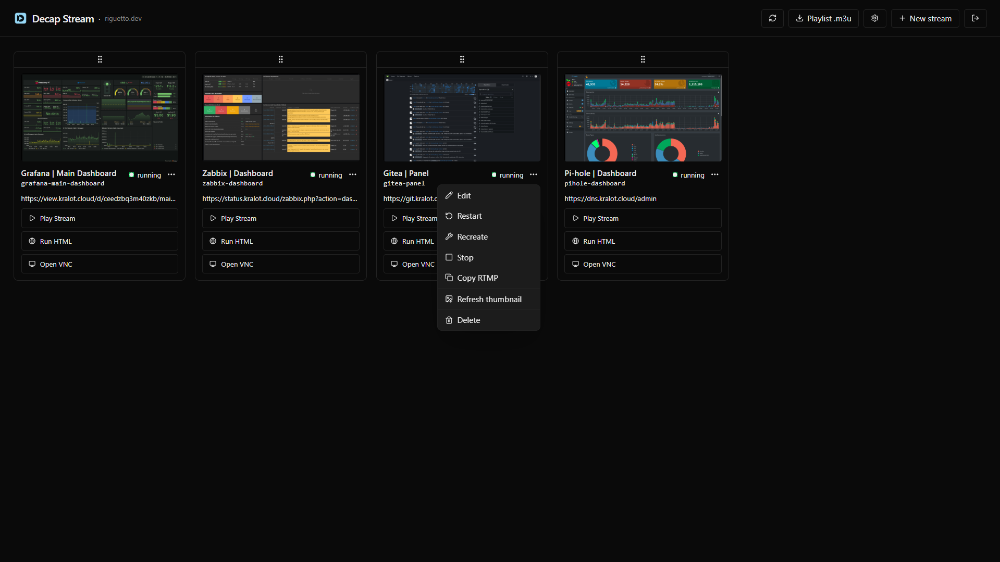
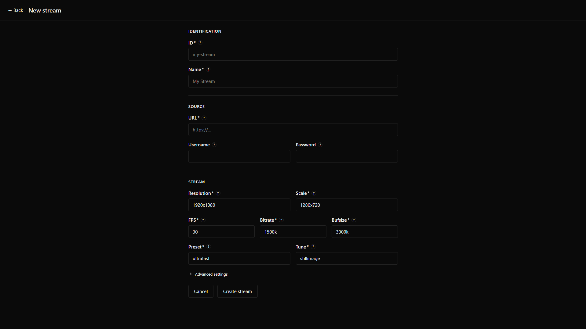
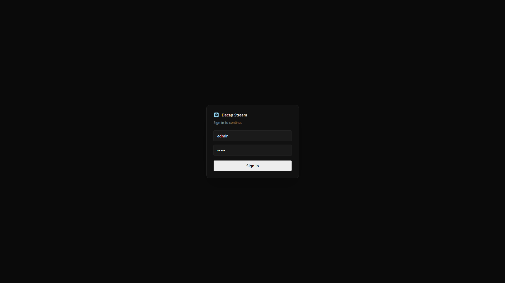

<p align="center">
  
</p>
<h1 align="center">Decap Stream</h1>

Turn any web page into an RTMP/HLS stream. Chromium renders the page, ffmpeg captures it, MediaMTX publishes it. Built for NOC environments and digital signage.

## Screenshots



<p align="center">
  
  
</p>

## How it works

Each stream runs its own isolated stack inside the container:

```
Xvfb (virtual display)
  └── Chromium (opens the URL)
        └── ffmpeg (x11grab → libx264 → RTMP → MediaMTX → HLS)
        └── x11vnc (live VNC access via noVNC)
```

All processes are managed by Supervisord. The web UI is a Next.js app that controls everything via a REST API.

## Features

- **Stream any URL** — if it loads in a browser, it streams
- **Dashboard with live thumbnails** — captured directly from the Xvfb display, refreshable on demand
- **Scalable card sizes** — mini/sm/md/lg sizes scale all card elements proportionally (buttons, text, icons, padding)
- **Inline VNC** — inspect any stream's virtual display without leaving the UI (`/vnc/{id}`)
- **Autologin with CDP detection** — configure credentials per stream; on restart, queries Chrome DevTools Protocol to skip login if the session is still alive
- **Persistent desired state** — streams remember if they were running or stopped and restore automatically on container restart
- **Optional authentication** — set `AUTH_USER` + `AUTH_PASS` to password-protect the entire UI; rolling 30-day session, no login required while active
- **Fully configurable encoding** — resolution, scale, FPS, bitrate, preset, tune, GOP, threads, all per stream
- **GPU acceleration** — optional per-stream Chromium GPU flag (disabled by default for container compatibility)
- **Built-in HLS player** — watch any stream in the browser via a standalone HTML page optimized for TVs (Back + Mute buttons, reconnect on stall, direct MediaMTX connection when available)
- **Per-card Pure mode** — toggle in the card menu to open Play Stream as a raw `.m3u8` link or Run HTML as a minimal `.html` page with no UI; works with native players and TV browsers
- **Per-card new tab** — toggle to open any button in a new tab instead of navigating in place; both settings are per-card and saved in the browser

## Platform Support

| Architecture | Status |
| ------------ | ------ |
| `linux/amd64` | ✅ Supported |
| `linux/arm64` | 🔜 Planned |

> arm64 support (Raspberry Pi, Apple Silicon servers) is planned for a future release.

## Quick Start

```yaml
# docker-compose.yml
services:
  decap-stream:
    image: ghcr.io/riguettodev/decap-stream:latest
    container_name: decap-stream
    restart: unless-stopped
    shm_size: "2gb"
    security_opt:
      - seccomp:unconfined   # required for Chromium syscalls
    environment:
      # TZ: America/Sao_Paulo
      # AUTH_USER: admin          # optional: enables login if both are set
      # AUTH_PASS: secure_password
    ports:
      - "3000:3000"             # Web UI — main entry point
      - "127.0.0.1:6080:6080"   # VNC — localhost only; remote access via tunnel/VPN
      # - "1935:1935"           # RTMP — expose only for external ingest (e.g. OBS)
      # - "8888:8888"           # HLS  — internal only; proxied through the UI at /api/hls/
    volumes:
      - streams:/app/data/streams # Persistent: streams.json, chrome profiles, thumbs
      # - logs:/app/data/logs       # Optional

volumes:
  streams:
```

```bash
docker compose up -d
```

Open **http://localhost:3000** and add your first stream.

> `seccomp:unconfined` is required because Chromium uses syscalls blocked by Docker's default seccomp profile.

> `shm_size: 2gb` prevents Chromium from crashing on `/dev/shm` exhaustion under load.

## Ports

| Port | Default | Description |
|------|---------|-------------|
| `3000` | exposed | Web UI (Next.js) — sole public entry point |
| `6080` | localhost only | noVNC (token-based routing to all streams) |
| `1935` | commented out | RTMP ingest (MediaMTX) — only needed for external ingest |
| `8888` | commented out | HLS output (MediaMTX) — proxied through Next.js at `/api/hls/` |

## RTMP & HLS URLs

Each stream gets a slug ID you define (e.g. `grafana-prod`):

| Protocol | URL |
|----------|-----|
| RTMP ingest | `rtmp://<host>:1935/live/<id>` |
| HLS manifest (proxied) | `http://<host>:3000/api/hls/live/<id>/index.m3u8` |
| HLS manifest (direct) | `http://<host>:8888/live/<id>/index.m3u8` — requires port 8888 exposed |
| HTML player | `http://<host>:3000/player.html?id=<id>` — static minimal page, no UI chrome |
| VNC (inline) | `http://<host>:3000/vnc/<id>` |

> **Pure mode** (toggle per card): Play Stream opens the proxied HLS `.m3u8` directly; Run HTML opens the `.html` player. Both can be pasted into VLC or any HLS-capable player, or loaded natively on TV browsers that support HLS.

## Stream Configuration

| Field | Default | Description |
|-------|---------|-------------|
| `id` | | Unique slug (lowercase, numbers, hyphens) |
| `name` | | Display name |
| `url` | | URL to open in Chromium |
| `user` / `pass` | | Credentials for autologin (optional) |
| `delay` | `15s` | Seconds before ffmpeg starts (allows page to load; also offsets first thumbnail) |
| `resolution` | `1920x1080` | Virtual display and capture size |
| `scale` | `1280x720` | Output video resolution |
| `fps` | `30` | Capture framerate |
| `bitrate` | `1500k` | Video bitrate |
| `bufsize` | `3000k` | Encoder buffer size |
| `preset` | `ultrafast` | x264 preset |
| `tune` | `stillimage` | x264 tune (`stillimage` for dashboards, `zerolatency` for dynamic content) |
| `gop` | `60` | Keyframe interval (auto-calculated as 2x FPS in the UI) |
| `threads` | `0` | ffmpeg encoding threads (`0` = auto-detect) |
| `gpu` | `false` | Enable Chromium GPU acceleration (requires host GPU + container access) |

## Architecture

```
┌─────────────────────────────────────────────────────────────┐
│  Container                                                  │
│                                                             │
│  Next.js :3000  ──API──►  Supervisord                       │
│    ├── /api/hls/ ──────►  MediaMTX :8888 (internal)         │
│    └── /vnc/{id} ──────►  noVNC :6080 (localhost)           │
│                              └── per stream:                │
│                                   ├── xvfb       (display)  │
│                                   ├── chromium   (browser)  │
│                                   ├── autologin  (CDP)      │
│                                   ├── x11vnc     (VNC)      │
│                                   └── ffmpeg     (encode)   │
│                                         │                   │
│  MediaMTX :1935/:8888  ◄────RTMP────────┘                   │
└─────────────────────────────────────────────────────────────┘
```

- `streams.json` flat file + one directory per stream under `/app/data/streams/{id}/`
- Each stream generates a `stream.conf` from a template; Supervisord picks it up via `[include]`
- Display number `:n` is auto-allocated; VNC port = `5900+n`, debug port = `9221+n`

## Development

```bash
npm install
npm run dev     # dev server — supervisorctl calls are mocked automatically
npm run build   # build Next.js standalone
npm run lint

./build.sh      # interactive Docker build
```

In dev mode (`NODE_ENV !== "production"`), all `supervisorctl` and `captureThumb` calls are replaced with console logs.

## Stack

- [Next.js 15](https://nextjs.org/) + TypeScript + Tailwind CSS v4
- [Supervisord](http://supervisord.org/)
- [MediaMTX](https://github.com/bluenviron/mediamtx)
- [HLS.js](https://github.com/video-dev/hls.js/)
- [noVNC](https://novnc.com/)
- [FFmpeg](https://ffmpeg.org)
- [Chromium](https://www.chromium.org)

## License

[MIT](/LICENSE)
